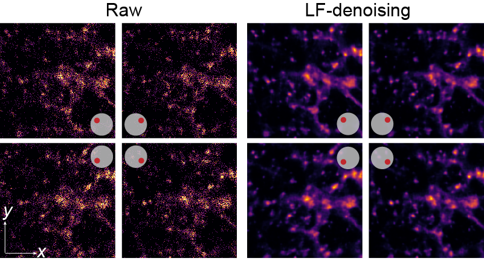

# Leveraging spatial-angular redundancy for self-supervised denoising of 3D fluorescence imaging without temporal dependency

# System requirements
## Recommended Configuration

We recommend the following configurations:

* 32GB RAM or more
* NVIDIA GPU (supports CUDA) with more than 8GB VRAM

This repository is tested on a NVIDIA Geforce RTX 3080 (10GB RAM) and 256GB RAM.

## Environment
There is no restriction on operation systems or specific python versions (as long as they are supported by Pytorch). This repository is tested on Python 3.8 with CUDA 11.5 and Ubuntu 16.04.This repository is tested on Python 3.8 with CUDA 11.5 and Ubuntu 16.04.

## Installation
Clone this repository and install all dependencies as follow:
```shell
pip install -r requirements.txt
``````

It is worthing noting that the PyTorch installed by pip should be manually checked. The PyTorch package is expected to be supported by your CUDA installation in this repository. For more information about compabilities between PyTorch and CUDA, please check [INSTALLING PREVIOUS VERSIONS OF PYTORCH](https://pytorch.org/get-started/previous-versions/).

# Demo
## Training LF-denoising

We provide a demo training dataset, which contains 59 LF images of α-tubulin membrane. You can train the demo model by following steps:

1. Download the dataset ([here](https://zenodo.org/records/16938669)). Place all the TIFF files in `example` to `./datasets/example/`.
2. To start your training process, run
```bash
python train.py
```
You can select a different GPU or a different epoch number by
```bash
python train.py --GPU 0 --n_epochs 50
```

You can also assign a different spatial patch size or angular size by 
```bash
python train.py --patch_s 128 --total_view 169 --radius 5
```

For more information about training script arguments, run
```bash
python train.py --help
```

The training process could take 1~2 hours, depending on your training configuration and the computation ability of your system.

## Testing LF-denoising

Download the dataset ([here](https://zenodo.org/records/11274187)). Place all the TIFF files in `example_test` to `./datasets/example_test/`.

You can test our pretrained model (download at [here](https://zenodo.org/records/16938762)) or train your own model as described in previous section.

To start your testing process, run

```bash
python test.py
```

The testing process will take usually 10 seconds ~ 3 minutes, depending on the computation ability of your system.

You can use your own model by assigning the pth directory, denoise model name and epoch number by

```bash
python test.py --pth_path ./pth --denoise_model test_model --ckp_idx 25
```

The denoised LF images will be output to `./results/{denoise_model}` by default.

# Results

The figure compares the raw and LF-denoising denoised LF of α-tubulin membrane and their maximum intensity projection of reconstructed 3D model.


For more results and further analysis, please refer to the companion paper []().

# Citation
If you use this code and relevant data, please cite the corresponding paper where original methods appeared:

Self-supervised light-field denoising empowers high-sensitivity fast 3D fluorescence imaging without temporal dependency. Submitted

# Correspondence
Should you have any questions regarding this code and the corresponding results, please contact Zhi Lu (luzhi@tsinghua.edu.cn).
